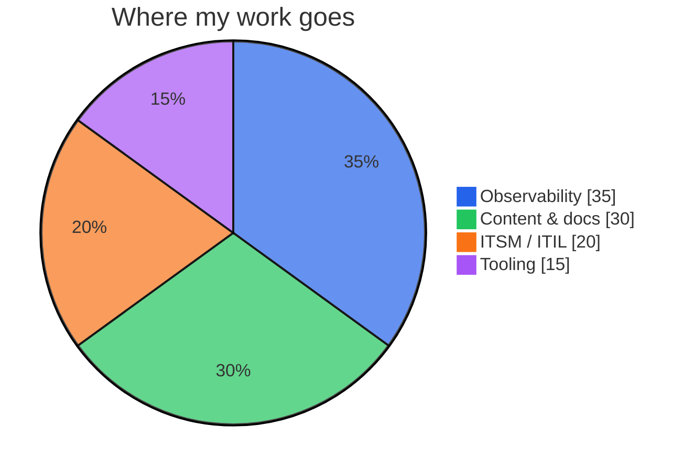
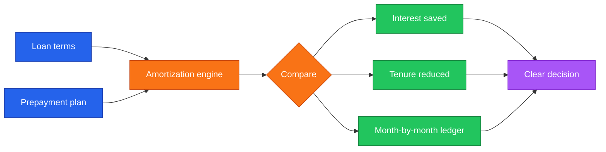
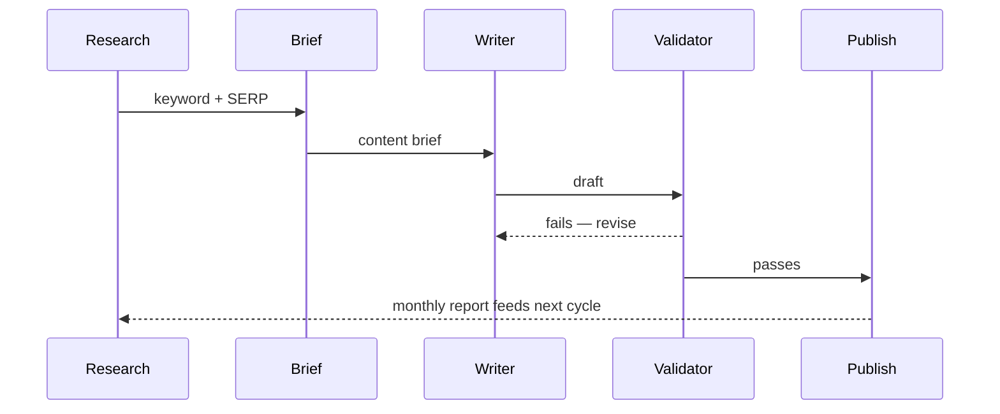
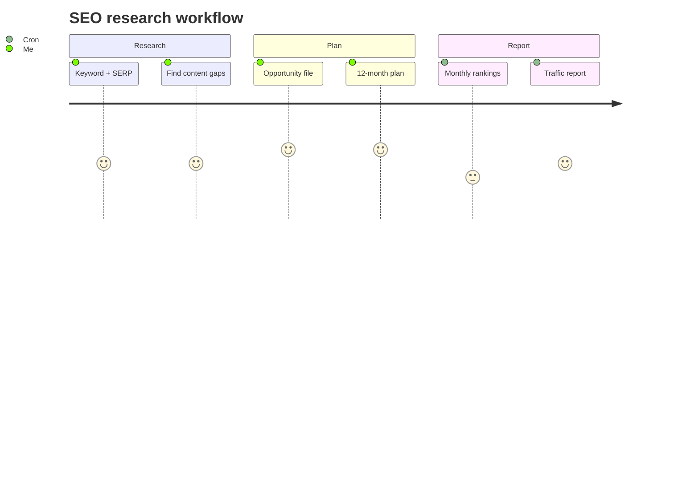
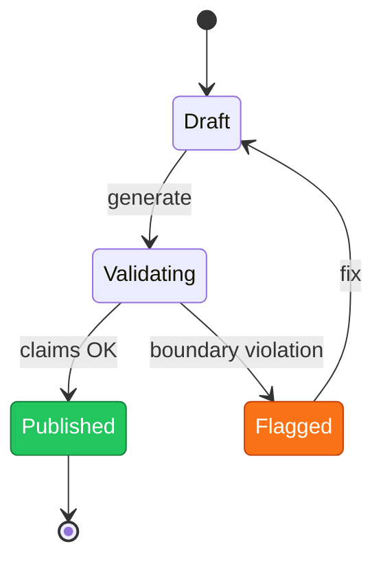
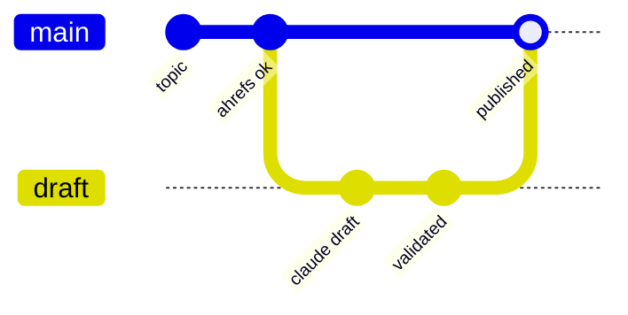

# Dharmik Shingala

#### Product &amp; Content for IT Operations

 

## &nbsp;👋 &nbsp;About

**Product & content for IT operations** — observability, monitoring, and ITSM at **[Motadata](https://www.motadata.com)**.
I write the docs and capability pages, and ship the small **Python / PowerShell** tools that make the work faster — across the ObserveOps and ServiceOps lines. I care about deciding what to defend before writing a word, and about building the small tool when the workflow needs one that doesn't exist.

## &nbsp;🧭 &nbsp;What I Work On

## &nbsp;🧰 &nbsp;Stack &amp; Domain

`Observability` &nbsp;·&nbsp; `APM` &nbsp;·&nbsp; `RUM` &nbsp;·&nbsp; `SLO` &nbsp;·&nbsp; `Log Analytics` &nbsp;·&nbsp; `Network Monitoring` &nbsp;·&nbsp; `NCCM` &nbsp;·&nbsp; `ITSM / ITIL` &nbsp;·&nbsp; `SEO`

## &nbsp;📊 &nbsp;GitHub Stats

## &nbsp;📂 &nbsp;Project Index

| Project | Domain | What it does | Status |
| --- | --- | --- | --- |
| [home-loan-planner](https://github.com/dharmik136/home-loan-planner) | Personal finance | Interactive HDFC prepayment planner | ✅ Shipped |
| [motadata-seo-research](https://github.com/dharmik136/motadata-seo-research) | SEO / content ops | Keyword tracking + monthly SEO reporting hub | 🟢 Active |
| [motadata-page-builder](https://github.com/dharmik136/motadata-page-builder) | Content ops | Capability-page generator + validator | 🟢 Active |
| [motadata-blog-automation](https://github.com/dharmik136/motadata-blog-automation) | Content ops | Ahrefs-validated, Claude-drafted blog pipeline | 🟢 Active |

---

## &nbsp;🏦 &nbsp;Flagship — Home Loan Prepayment Planner

> Turns a messy amortization question — *"if I prepay ₹X now, what does it actually save me?"* — into a clear, visual decision. A single-file web app, no install.

<b>More detail</b>

- **Problem** — prepayment math is opaque; spreadsheets hide the trade-off between saving interest and shortening tenure.
- **Solution** — a self-contained HTML/JS planner: enter the loan plus a prepayment plan, see interest saved, tenure cut, and a full ledger side-by-side.
- **Trade-offs** — single-file simplicity over a backend; everything runs client-side so it's shareable and private.
- **Learnings** — the right output isn't a number, it's a *decision* — so the UI leads with "what you save," not the table.

## &nbsp;✍️ &nbsp;Content Engine — How Motadata Content Gets Made

> The product-content work, as a sequence. Research decides what to defend; automation keeps it fresh; review keeps it honest.

<b>The repos behind it</b>

| Repo | Role in the pipeline |
| --- | --- |
| **motadata-seo-research** | The research front-end — keyword tracking, SERP analysis, monthly reports, the 12-month plan. |
| **motadata-page-builder** | Generates and **validates** capability/product pages against approved claims and module boundaries. |
| **motadata-blog-automation** | Topic → Ahrefs validation → Claude draft → validation → publish, run on GitHub Actions. |

## &nbsp;🔎 &nbsp;motadata-seo-research

<b>What it does</b>

An SEO research hub for motadata.com: tracks keyword positions, runs competitive/SERP analysis, and auto-generates monthly health reports — all wired to a 12-month action plan. Claude Code automations do the heavy lifting on demand or on a schedule.

## &nbsp;🏗️ &nbsp;motadata-page-builder

<b>What it does</b>

Generates product capability and feature pages from approved source material, then **validates** them — every claim has to be approved and every page has to stay inside its module's content boundary. The validator is the point: it stops scope drift before publish.

## &nbsp;📰 &nbsp;motadata-blog-automation

<b>What it does</b>

A Claude-powered blog pipeline: validates topics against Ahrefs data, drafts SEO-optimized posts, validates them, and publishes — orchestrated with GitHub Actions so the cadence doesn't depend on anyone remembering.

## &nbsp;🧪 &nbsp;Experiments &amp; Smaller Tools

<b>A few more things I've built</b>

- **claude-enter** — a tiny scheduled `VK_RETURN` injector for Windows; pure stdlib + Win32. The "write the small tool when none exists" rule, literally.
- **research-paper-decoder** — a decoder/parser for research-paper artifacts (a focused parsing project).
- **A self-updating profile dossier** — an earlier experiment that rendered this very README from data via a Python "clerk" + GitHub Actions. Retired in favor of readability, but a fun lesson in what GitHub will and won't render.

## &nbsp;🧱 &nbsp;How I Work

> Three rules, operational not aspirational:

1. **Decide what to defend first; write second.** Most B2B content drifts because nobody decided what to defend.
2. **Specificity is the only luxury that scales.** Sharp positioning beats decorative writing, every time.
3. **When the workflow needs a tool that doesn't exist, write a small one.** The smaller the better.

## &nbsp;📌 &nbsp;Now

- 🛰️ Capability pages and RFP answers across ObserveOps & ServiceOps modules
- 🔬 SEO research + content automation for motadata.com
- 🧰 Small tools that remove repetitive steps from the content workflow

## &nbsp;🤝 &nbsp;Reach Me

Talk to me about **observability · ITSM / ITIL · technical content · SEO · small automations**.

 

Decide what to defend first; write second. &nbsp;·&nbsp; Specificity is the only luxury that scales.

