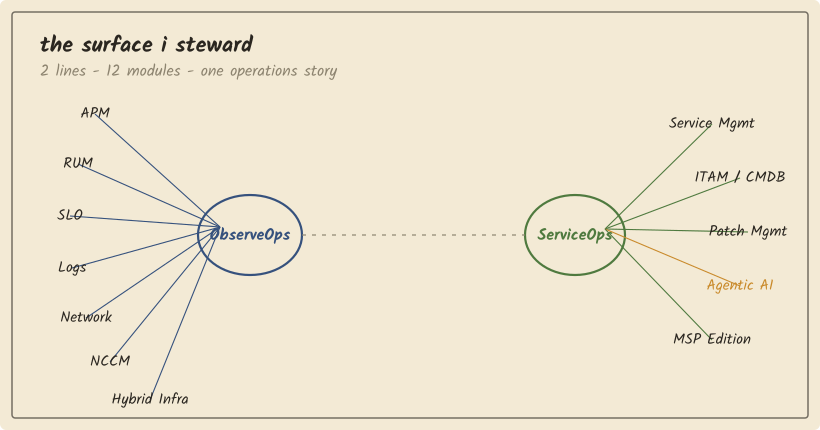
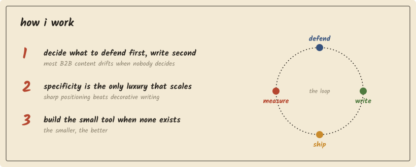
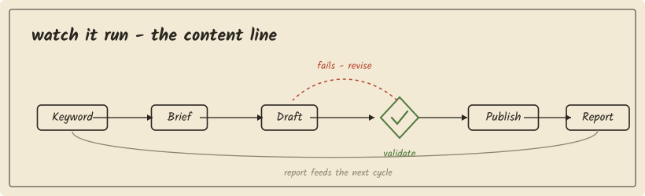
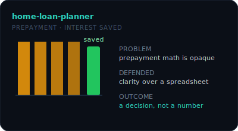
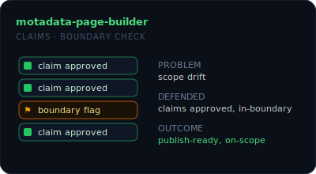

## About

**Product & content for IT operations** — observability, monitoring, and ITSM at **[Motadata](https://www.motadata.com)**.
I write the docs and capability pages, and ship the small **Python / PowerShell** tools that make the work faster — across the ObserveOps and ServiceOps lines. The rest of this page is a field notebook: scroll the pages, top to bottom.

**[LinkedIn ↗](https://www.linkedin.com/in/aatmaa)** &nbsp;·&nbsp; **[Email ↗](mailto:dhashingala9@gmail.com)** &nbsp;·&nbsp; **[motadata.com ↗](https://www.motadata.com)**

 

<i>Flying small, precise things on a single line — from Gujarat, India.</i>

 

 

 

 

&nbsp;

| Project | What I defended | Status |
| --- | --- | --- |
| **[home-loan-planner](https://github.com/dharmik136/home-loan-planner)** | a decision over a number | ✅ Shipped |
| **[motadata-seo-research](https://github.com/dharmik136/motadata-seo-research)** | what to rank for, on evidence | 🟢 Active |
| **[motadata-page-builder](https://github.com/dharmik136/motadata-page-builder)** | every claim approved, in-boundary | 🟢 Active |
| **[motadata-blog-automation](https://github.com/dharmik136/motadata-blog-automation)** | cadence without drift | 🟢 Active |

<b>Smaller tools &amp; experiments</b>

- **claude-enter** — a tiny scheduled `VK_RETURN` injector for Windows; pure stdlib + Win32.
- **research-paper-decoder** — a focused parser for research-paper artifacts.
- **This profile** — a hand-built, hand-inked notebook; the README is itself the small tool.

 

<i>A sikku kolam — one unbroken line, no loose ends. The way I like a system to run.</i>

&nbsp;

Talk to me about **observability · ITSM / ITIL · technical content · SEO · small automations**.

**[Connect on LinkedIn ↗](https://www.linkedin.com/in/aatmaa)** &nbsp;·&nbsp; **[Email me ↗](mailto:dhashingala9@gmail.com)**

