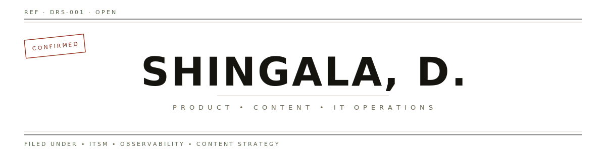

<picture>
  <source media="(prefers-color-scheme: dark)" srcset="./assets/header-dark.svg">
  
</picture>

<picture>
  <source media="(prefers-color-scheme: dark)" srcset="./assets/masthead-dark.svg">
  
</picture>

## §01 &nbsp; DOCTRINE

<picture>
  <source media="(prefers-color-scheme: dark)" srcset="./assets/doctrine-dark.svg">
  
</picture>

## §02 &nbsp; OPEN DOSSIERS

<table>
<thead><tr><th align="left">REF</th><th align="left">TITLE</th><th align="left">DOMAIN</th><th align="left">STATUS</th></tr></thead>
<tbody>
<tr><td><code>DRS-001</code></td><td>claude-enter</td><td>workflow automation</td><td></td></tr>
<tr><td><code>DRS-002</code></td><td>Motadata content system</td><td>content operations</td><td></td></tr>
<tr><td><code>DRS-003</code></td><td>ITSM positioning brief</td><td>positioning · ITSM</td><td></td></tr>
</tbody>
</table>

## §07 &nbsp; FIELD LOG

<!--FIELDLOG:START-->
`— no recent field activity on record —`
<!--FIELDLOG:END-->

## §04 &nbsp; CHANNEL ASSIGNMENTS

<a href="https://www.linkedin.com/in/aatmaa/">LinkedIn</a> &nbsp;·&nbsp; <a href="mailto:dhashingala9@gmail.com">Email</a>

---

<!--FOOTER:START-->
FILED 2026·06·16 · ENTRY No.1 · THIS DOSSIER IS LIVE (re-filed 2026·06·16)
<!--FOOTER:END-->
